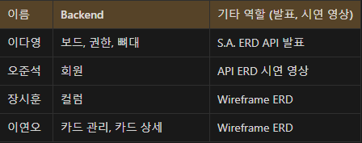
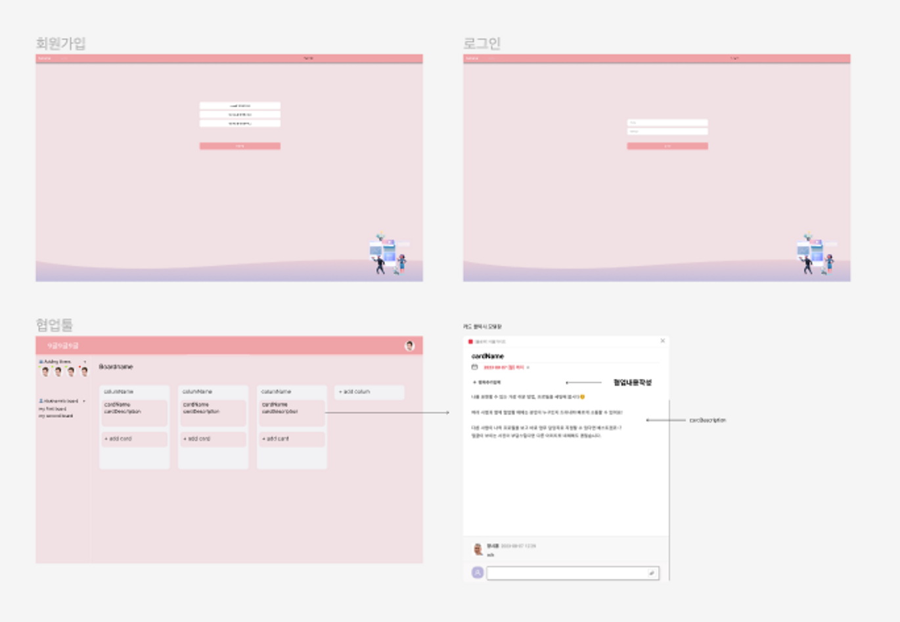
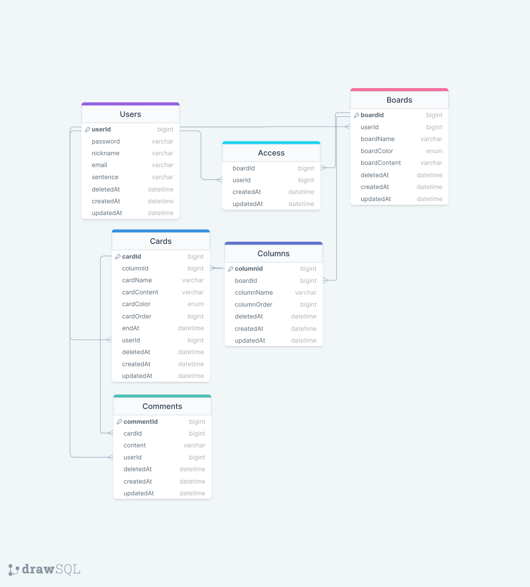

# 9글9글9글 9조 구글링해봤어 team project

## Project

### 프로젝트 명칭

9글9글9글

### 프로젝트 목적과 기능

프로젝트 관리와 작업 흐름 관리에 사용되는 프로젝트

### 중요로직

**초대 받기**

1. userId 생성
2. Board에 접근을 했을 때 userId , boardId가 일치하는 Access 데이터가 있으면 Board 작성 가능
3. 아닐 경우 return 400

**초대하기**

1. userId 생성
2. userId 로그인
3. Board 생성 (boardId, userId)
4. Board에 해당하는 userId를 가진 사람만 Access table에 해당 boardid를 넣은 데이터를 생성할 수있다.
5. 즉, 권한을 가진 사람만 초대 가능.

## TEAM

### 팀 규칙

- 약속한 시간에 자리에 있기, 부재중 슬랙에 남기기

- 아무리 바빠도 밥 시간 지키기 (밥 시간 연락 금지)

- 현재 부정적인 상황일 경우 빠른 공유

- 소통 중요

- 예쁜 말 사용

- 구글링 해 보기

- 9조 가족 존중하기

- 20시 50분부터 21시 00분 까지 [9조 마무리 회의]
  (질문이 있는 분은 21시 00분 이후에 이어서 진행)

### 기능 역할 분담



역할 분담 먼저 완료한 인원

1.  프론트엔드
2.  CI/CD 시도하기

## Coding Convention

### Architecture Layered Pattern

    - controller : req, res만 사용
    - service : 모든 비즈니스 로직
    - repository : 데이터베이스 접근 로직

### 변수, 클래스, 함수 네이밍

    - 변수 : 카멜케이스, const, let (var X)
    - 클래스 : 클래스명 첫 글자는 대문자
    - 함수 : 기능을 잘 설명할 수 있는 단어

- prettierrc : airbnb 참고

**[ Commit Message Convention ]**

      `feat` : 새로운 기능 추가 (Add …)
      `fix` : 코드 수정 (Change, Delete …)
      `docs` : 문서 수정 (README.md 등)
      `style` : 코드에 변경이 없는 단순 줄바꿈, 여백 수정
      `refactor` : 코드 리팩토링
      `test` : 테스트 코드 추가
      `chore` : 빌드 업무 수정, 패키지 매니저 수정

**[기능별 브랜치]**

      `users` : 회원가입/로그인.
      `access` : 권한 관리
      `boards` : 보드 관리
      `columns` : 컬럼 관리
      `cards` : 카드 관리
      `comments` : 댓글 관리

**[최종 집합 브랜치]**

      `develope` : 개발 (기능별 브랜치 집합)
      `master` : 배포

- Commit Message 내용은 한글로 작성
- Commit은 기능 단위 완성 시 하기
- Commit 전에 불필요한 주석 제거
- merge는 약속된 시간에 모여서 진행
- 기능 별로 주석 제목 달기

### try-catch

service layer에는 넣도록 노력하기

## Tech

- Javascript
- Express
- AWS - S3, CodeDeploy, EC2

## Wireframe



## 프로젝트 세팅

      "dependencies": {
      "@babel/cli": "^7.22.9",
      "dotenv": "^16.3.1",
      "express": "^4.18.2",
      "mysql2": "^3.5.2",
      "node-cache": "^5.1.2",
      "readline": "^1.3.0",
      "sequelize": "^6.32.1"
      },
      "devDependencies": {
      "@babel/core": "^7.22.9",
      "@babel/node": "^7.22.6",
      "@babel/preset-env": "^7.22.9",
      "jest": "^29.6.2",
      "nodemon": "^3.0.1",
      "prettier": "^3.0.0",
      "sequelize-cli": "^6.6.1",
      "supertest": "^6.3.3"
      }

## ERD



## API

https://verdantjuly.gitbook.io/trello9-api/

## 파일구조

```
9gle9gle9gle-9team-project
─ src
   ├─ app.js
   ├─ cache.js
   ├─ controllers
   │  ├─ boards.controller.js
   │  └─ columns.controller.js
   ├─ db
   │  ├─ index.js
   │  ├─ models
   │  │  ├─ access.js
   │  │  ├─ boards.js
   │  │  ├─ cards.js
   │  │  ├─ columns.js
   │  │  ├─ comments.js
   │  │  ├─ enum.js
   │  │  └─ users.js
   │  ├─ relations
   │  │  ├─ access.relation.js
   │  │  ├─ boards.relation.js
   │  │  ├─ cards.realtaion.js
   │  │  ├─ columns.relation.js
   │  │  ├─ comments.relation.js
   │  │  ├─ index.js
   │  │  └─ users.relation.js
   │  └─ sequelize.js
   ├─ env.js
   ├─ init.js
   ├─ repositories
   │  ├─ boards.repository.js
   │  └─ columns.repository.js
   ├─ routes
   │  ├─ boards.routes.js
   │  └─ columns.routes.js
   └─ services
      ├─ boards.service.js
      ├─ columns.service.js
      └─ message.js

```
